# AcadSync class diagram

The classes below are every class in `backend/domain/`, `backend/Env.php` and `backend/Mailer.php` (the OOP model) and
`backend/custom_dsa.php` (the data structures and algorithms), with their real names, fields, methods
and visibility. Long method lists are shortened to the methods the app relies on.
GitHub draws these diagrams automatically; they can also be pasted into <https://mermaid.live> to
export a PNG for the documentation.

## How to read the diagrams

- **Visibility:** `+` public, `-` private, `#` protected. `*` marks an abstract method, `$` a static one.
- **Lines:** hollow triangle = inheritance (dashed when a class implements an interface), filled diamond =
  composition, hollow diamond = aggregation, solid arrow = association, dashed arrow = dependency (uses).
- **One figure per page.** The model is too big for one page, so it is split into 20 figures. Figures with
  two parts (a and b) show both parts on the same page.
- **Off-page connectors.** When a figure needs a class that is drawn in full on another page, the class
  appears as an empty box marked **«see Figure N»**. It is the same class: go to Figure N for its fields
  and methods. The table shows which pages connect.

| Figure | Content | Connects to |
| --- | --- | --- |
| 1 | `Person`, `Member` | 2, 3 |
| 2 | `Officer` and the four offices | 1 |
| 3 | `Permission`, `MemberStatus` and its three statuses | 1 |
| 4 | `Activity`, `RsvpActivity`, `PartsActivity` | — |
| 5 | Meeting, seminar, outreach and section event | 4 |
| 6 | Competition and section project | 4 |
| 7 | `ActivityPart`, `PartRoster` | 4, 18 |
| 8 | `ActivityRoster`, `MemberRecord` | 1, 4, 18 |
| 9 | `Task`, `IndividualTask`, `GroupTask` | 10, 11 |
| 10 | `Deadline` and its implementations | 9 |
| 11 | `GroupRule`, its four rules, `StudyGroup` | 9 |
| 12 | `Payment`, `CashPayment`, `GcashPayment` | 1, 13 |
| 13 | `PaymentClaim`, `Due` | 3, 12 |
| 14 | `Announcement`, `AnnouncementContext` | — |
| 15 | The six announcement kinds | 4, 9, 13, 14, 18 |
| 16 | Undo actions | 18 |
| 17 | `Mailer`, `Env` | — |
| 18 | Fixed array, week grid, hash set, linked list, stack, queue | — |
| 19 | Trees and the dependency graph | 18 |
| 20 | `Algorithms`, `DsaUtil` | — |

## Figure 1. People: `Person` and `Member`

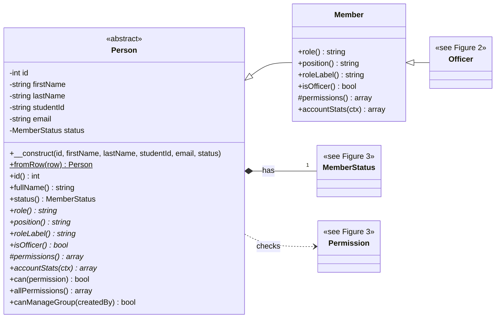
```mermaid
classDiagram
    direction LR
    class Person {
        <<abstract>>
        -int id
        -string firstName
        -string lastName
        -string studentId
        -string email
        -MemberStatus status
        +__construct(id, firstName, lastName, studentId, email, status)
        +fromRow(row)$ Person
        +id() int
        +fullName() string
        +status() MemberStatus
        +role()* string
        +position()* string
        +roleLabel()* string
        +isOfficer()* bool
        #permissions()* array
        +accountStats(ctx)* array
        +can(permission) bool
        +allPermissions() array
        +canManageGroup(createdBy) bool
    }
    class Member {
        +role() string
        +position() string
        +roleLabel() string
        +isOfficer() bool
        #permissions() array
        +accountStats(ctx) array
    }
    class Officer {
        <<see Figure 2>>
    }
    class MemberStatus {
        <<see Figure 3>>
    }
    class Permission {
        <<see Figure 3>>
    }
    Person <|-- Member
    Member <|-- Officer
    Person *-- "1" MemberStatus : has
    Person ..> Permission : checks
```

Continued in Figure 2 (`Officer`) and Figure 3 (`MemberStatus`, `Permission`).

## Figure 2. Officers

Every officer is a member, so officers inherit a member's methods (Figure 1).

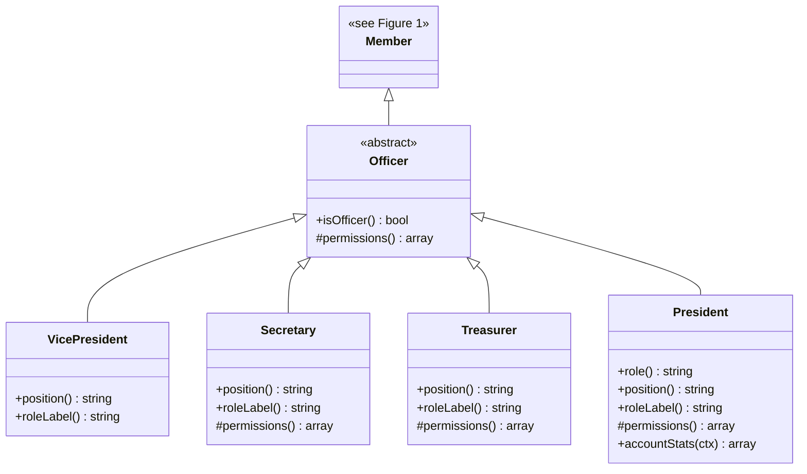
```mermaid
classDiagram
    direction TB
    class Member {
        <<see Figure 1>>
    }
    class Officer {
        <<abstract>>
        +isOfficer() bool
        #permissions() array
    }
    class VicePresident {
        +position() string
        +roleLabel() string
    }
    class Secretary {
        +position() string
        +roleLabel() string
        #permissions() array
    }
    class Treasurer {
        +position() string
        +roleLabel() string
        #permissions() array
    }
    class President {
        +role() string
        +position() string
        +roleLabel() string
        #permissions() array
        +accountStats(ctx) array
    }
    Member <|-- Officer
    Officer <|-- VicePresident
    Officer <|-- Secretary
    Officer <|-- Treasurer
    Officer <|-- President
```

## Figure 3. Permissions and membership status

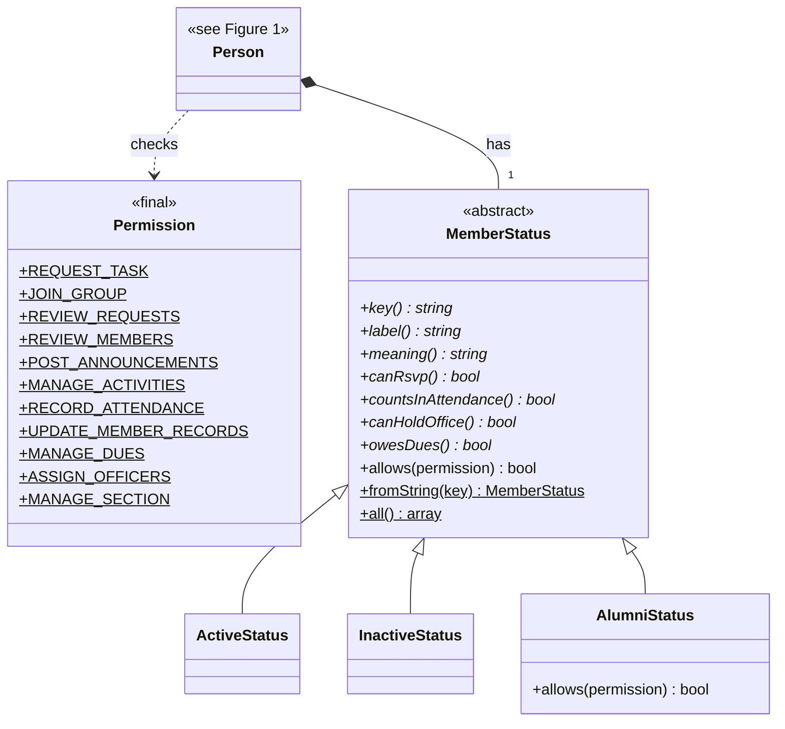
```mermaid
classDiagram
    direction TB
    class Person {
        <<see Figure 1>>
    }
    class Permission {
        <<final>>
        +REQUEST_TASK$
        +JOIN_GROUP$
        +REVIEW_REQUESTS$
        +REVIEW_MEMBERS$
        +POST_ANNOUNCEMENTS$
        +MANAGE_ACTIVITIES$
        +RECORD_ATTENDANCE$
        +UPDATE_MEMBER_RECORDS$
        +MANAGE_DUES$
        +ASSIGN_OFFICERS$
        +MANAGE_SECTION$
    }
    class MemberStatus {
        <<abstract>>
        +key()* string
        +label()* string
        +meaning()* string
        +canRsvp()* bool
        +countsInAttendance()* bool
        +canHoldOffice()* bool
        +owesDues()* bool
        +allows(permission) bool
        +fromString(key)$ MemberStatus
        +all()$ array
    }
    class ActiveStatus
    class InactiveStatus
    class AlumniStatus {
        +allows(permission) bool
    }
    Person ..> Permission : checks
    Person *-- "1" MemberStatus : has
    MemberStatus <|-- ActiveStatus
    MemberStatus <|-- InactiveStatus
    MemberStatus <|-- AlumniStatus
```

## Figure 4. Activities: base classes

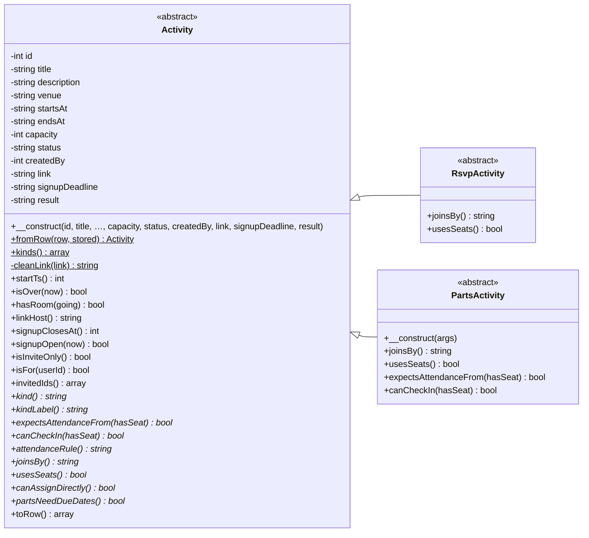
```mermaid
classDiagram
    direction LR
    class Activity {
        <<abstract>>
        -int id
        -string title
        -string description
        -string venue
        -string startsAt
        -string endsAt
        -int capacity
        -string status
        -int createdBy
        -string link
        -string signupDeadline
        -string result
        +__construct(id, title, …, capacity, status, createdBy, link, signupDeadline, result)
        +fromRow(row, stored)$ Activity
        +kinds()$ array
        -cleanLink(link)$ string
        +startTs() int
        +isOver(now) bool
        +hasRoom(going) bool
        +linkHost() string
        +signupClosesAt() int
        +signupOpen(now) bool
        +isInviteOnly() bool
        +isFor(userId) bool
        +invitedIds() array
        +kind()* string
        +kindLabel()* string
        +expectsAttendanceFrom(hasSeat)* bool
        +canCheckIn(hasSeat)* bool
        +attendanceRule()* string
        +joinsBy()* string
        +usesSeats()* bool
        +canAssignDirectly()* bool
        +partsNeedDueDates()* bool
        +toRow() array
    }
    class RsvpActivity {
        <<abstract>>
        +joinsBy() string
        +usesSeats() bool
    }
    class PartsActivity {
        <<abstract>>
        +__construct(args)
        +joinsBy() string
        +usesSeats() bool
        +expectsAttendanceFrom(hasSeat) bool
        +canCheckIn(hasSeat) bool
    }
    Activity <|-- RsvpActivity
    Activity <|-- PartsActivity
```

Continued in Figure 5 (RSVP kinds), Figure 6 (parts kinds), Figures 7 and 8 (parts and rosters).

## Figure 5. Activity kinds people RSVP to

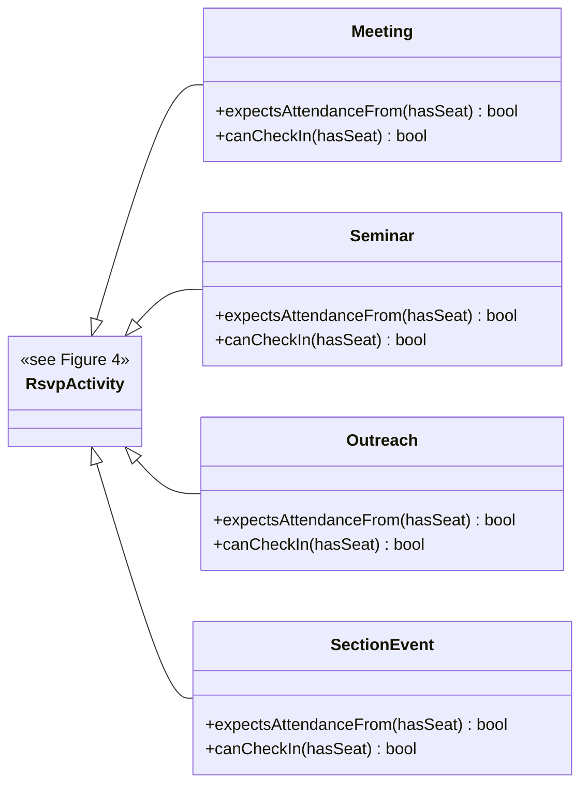
```mermaid
classDiagram
    direction LR
    class RsvpActivity {
        <<see Figure 4>>
    }
    class Meeting {
        +expectsAttendanceFrom(hasSeat) bool
        +canCheckIn(hasSeat) bool
    }
    class Seminar {
        +expectsAttendanceFrom(hasSeat) bool
        +canCheckIn(hasSeat) bool
    }
    class Outreach {
        +expectsAttendanceFrom(hasSeat) bool
        +canCheckIn(hasSeat) bool
    }
    class SectionEvent {
        +expectsAttendanceFrom(hasSeat) bool
        +canCheckIn(hasSeat) bool
    }
    RsvpActivity <|-- Meeting
    RsvpActivity <|-- Seminar
    RsvpActivity <|-- Outreach
    RsvpActivity <|-- SectionEvent
```

## Figure 6. Activity kinds split into parts

Competitions and section projects never touch attendance; members volunteer for parts instead (Figure 7).

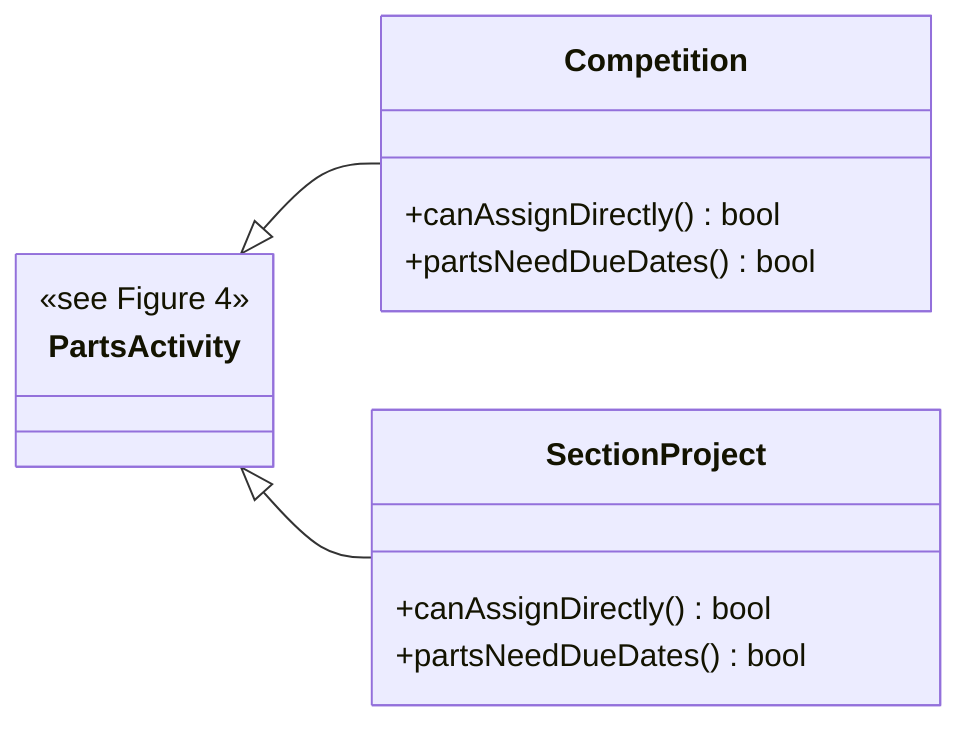
```mermaid
classDiagram
    direction LR
    class PartsActivity {
        <<see Figure 4>>
    }
    class Competition {
        +canAssignDirectly() bool
        +partsNeedDueDates() bool
    }
    class SectionProject {
        +canAssignDirectly() bool
        +partsNeedDueDates() bool
    }
    PartsActivity <|-- Competition
    PartsActivity <|-- SectionProject
```

## Figure 7. Activity parts

**7a. A part of a competition or project**

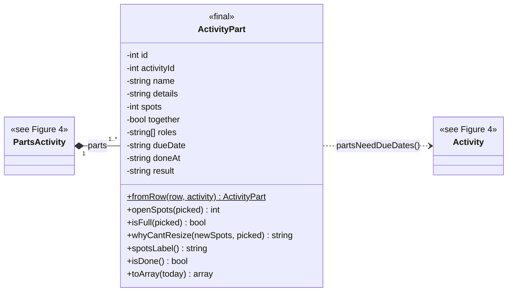
```mermaid
classDiagram
    direction LR
    class PartsActivity {
        <<see Figure 4>>
    }
    class Activity {
        <<see Figure 4>>
    }
    class ActivityPart {
        <<final>>
        -int id
        -int activityId
        -string name
        -string details
        -int spots
        -bool together
        -string[] roles
        -string dueDate
        -string doneAt
        -string result
        +fromRow(row, activity)$ ActivityPart
        +openSpots(picked) int
        +isFull(picked) bool
        +whyCantResize(newSpots, picked) string
        +spotsLabel() string
        +isDone() bool
        +toArray(today) array
    }
    PartsActivity "1" *-- "1..*" ActivityPart : parts
    ActivityPart ..> Activity : partsNeedDueDates()
```

**7b. Who is on a part**

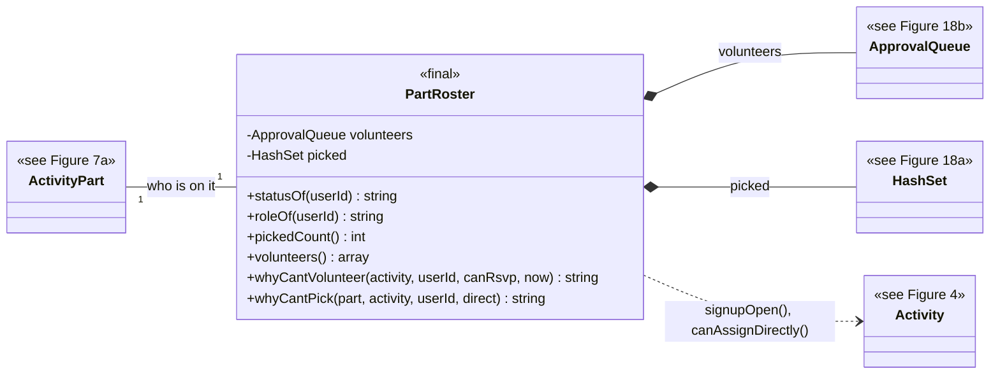
```mermaid
classDiagram
    direction LR
    class ActivityPart {
        <<see Figure 7a>>
    }
    class Activity {
        <<see Figure 4>>
    }
    class HashSet {
        <<see Figure 18a>>
    }
    class ApprovalQueue {
        <<see Figure 18b>>
    }
    class PartRoster {
        <<final>>
        -ApprovalQueue volunteers
        -HashSet picked
        +statusOf(userId) string
        +roleOf(userId) string
        +pickedCount() int
        +volunteers() array
        +whyCantVolunteer(activity, userId, canRsvp, now) string
        +whyCantPick(part, activity, userId, direct) string
    }
    ActivityPart "1" -- "1" PartRoster : who is on it
    PartRoster *-- ApprovalQueue : volunteers
    PartRoster *-- HashSet : picked
    PartRoster ..> Activity : signupOpen(), canAssignDirectly()
```

## Figure 8. Rosters and member records

**8a. Seats, check-ins and the waitlist of one activity**

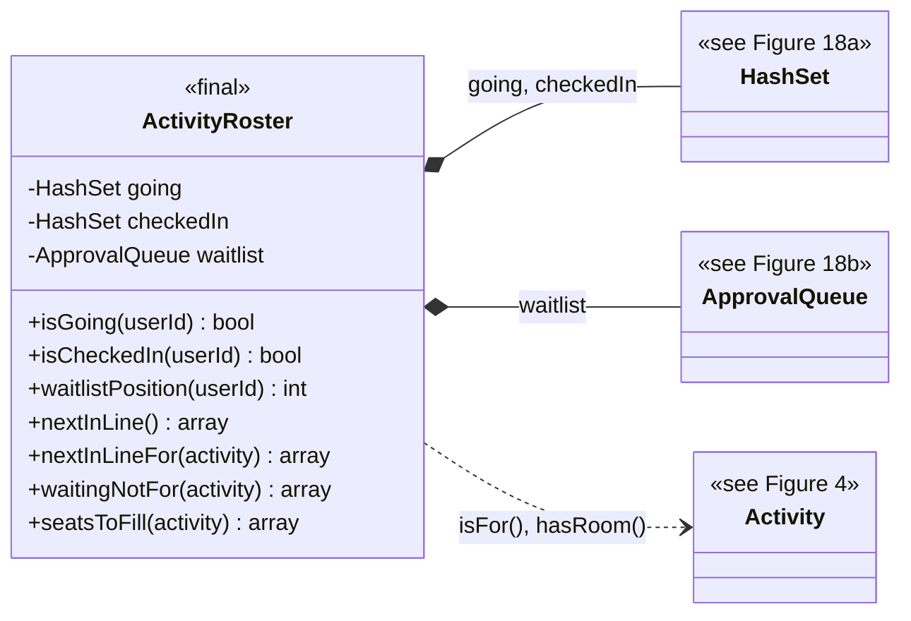
```mermaid
classDiagram
    direction LR
    class Activity {
        <<see Figure 4>>
    }
    class HashSet {
        <<see Figure 18a>>
    }
    class ApprovalQueue {
        <<see Figure 18b>>
    }
    class ActivityRoster {
        <<final>>
        -HashSet going
        -HashSet checkedIn
        -ApprovalQueue waitlist
        +isGoing(userId) bool
        +isCheckedIn(userId) bool
        +waitlistPosition(userId) int
        +nextInLine() array
        +nextInLineFor(activity) array
        +waitingNotFor(activity) array
        +seatsToFill(activity) array
    }
    ActivityRoster *-- HashSet : going, checkedIn
    ActivityRoster *-- ApprovalQueue : waitlist
    ActivityRoster ..> Activity : isFor(), hasRoom()
```

**8b. A member's attendance record**

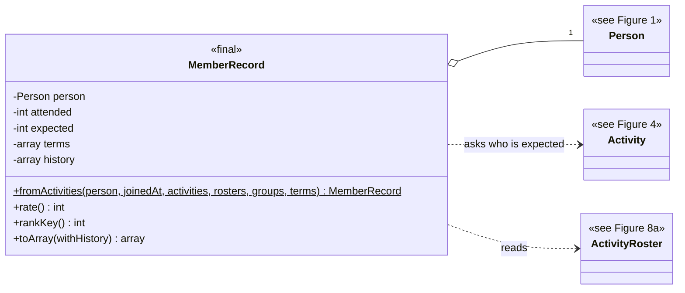
```mermaid
classDiagram
    direction LR
    class Activity {
        <<see Figure 4>>
    }
    class Person {
        <<see Figure 1>>
    }
    class ActivityRoster {
        <<see Figure 8a>>
    }
    class MemberRecord {
        <<final>>
        -Person person
        -int attended
        -int expected
        -array terms
        -array history
        +fromActivities(person, joinedAt, activities, rosters, groups, terms)$ MemberRecord
        +rate() int
        +rankKey() int
        +toArray(withHistory) array
    }
    MemberRecord o-- "1" Person
    MemberRecord ..> Activity : asks who is expected
    MemberRecord ..> ActivityRoster : reads
```

## Figure 9. Tasks

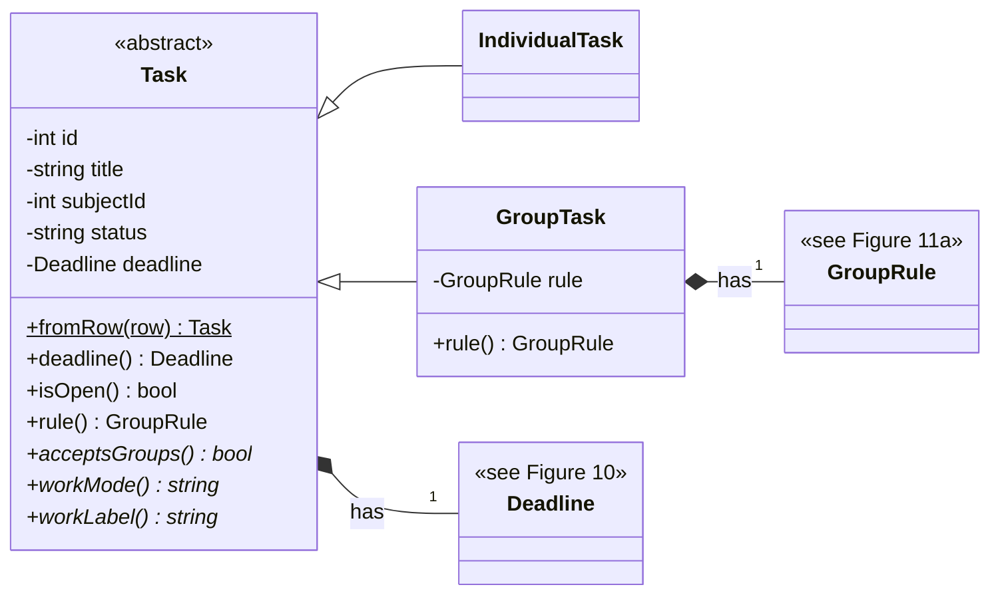
```mermaid
classDiagram
    direction LR
    class Task {
        <<abstract>>
        -int id
        -string title
        -int subjectId
        -string status
        -Deadline deadline
        +fromRow(row)$ Task
        +deadline() Deadline
        +isOpen() bool
        +rule() GroupRule
        +acceptsGroups()* bool
        +workMode()* string
        +workLabel()* string
    }
    class IndividualTask
    class GroupTask {
        -GroupRule rule
        +rule() GroupRule
    }
    class Deadline {
        <<see Figure 10>>
    }
    class GroupRule {
        <<see Figure 11a>>
    }
    Task <|-- IndividualTask
    Task <|-- GroupTask
    Task *-- "1" Deadline : has
    GroupTask *-- "1" GroupRule : has
```

Continued in Figure 10 (`Deadline`) and Figure 11 (`GroupRule`).

## Figure 10. Deadlines

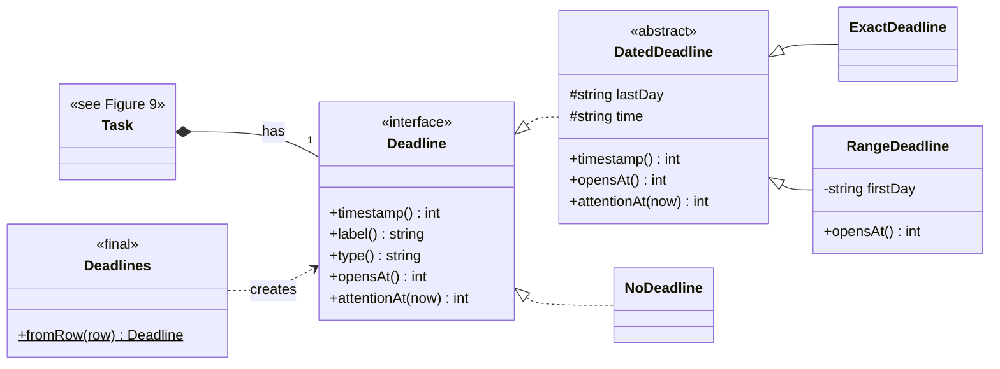
```mermaid
classDiagram
    direction LR
    class Task {
        <<see Figure 9>>
    }
    class Deadline {
        <<interface>>
        +timestamp() int
        +label() string
        +type() string
        +opensAt() int
        +attentionAt(now) int
    }
    class DatedDeadline {
        <<abstract>>
        #string lastDay
        #string time
        +timestamp() int
        +opensAt() int
        +attentionAt(now) int
    }
    class ExactDeadline
    class RangeDeadline {
        -string firstDay
        +opensAt() int
    }
    class NoDeadline
    class Deadlines {
        <<final>>
        +fromRow(row)$ Deadline
    }
    Task *-- "1" Deadline : has
    Deadlines ..> Deadline : creates
    Deadline <|.. DatedDeadline
    Deadline <|.. NoDeadline
    DatedDeadline <|-- ExactDeadline
    DatedDeadline <|-- RangeDeadline
```

## Figure 11. Group rules

**11a. The rule a group task owns**

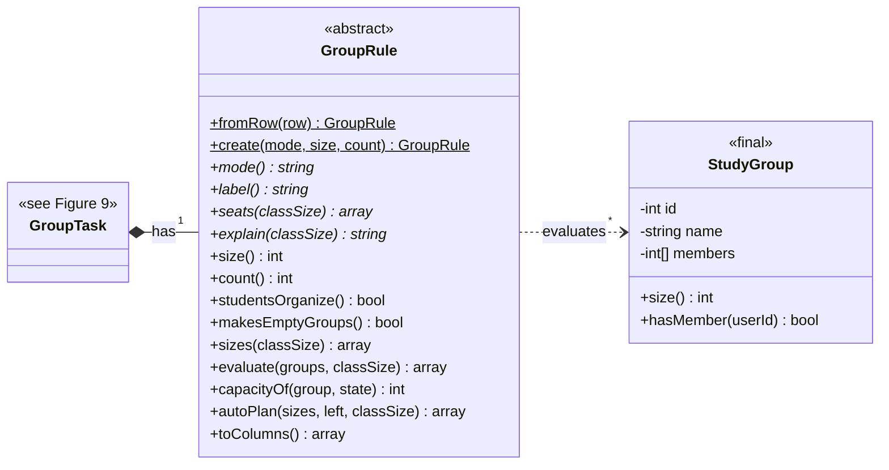
```mermaid
classDiagram
    direction LR
    class GroupTask {
        <<see Figure 9>>
    }
    class GroupRule {
        <<abstract>>
        +fromRow(row)$ GroupRule
        +create(mode, size, count)$ GroupRule
        +mode()* string
        +label()* string
        +seats(classSize)* array
        +explain(classSize)* string
        +size() int
        +count() int
        +studentsOrganize() bool
        +makesEmptyGroups() bool
        +sizes(classSize) array
        +evaluate(groups, classSize) array
        +capacityOf(group, state) int
        +autoPlan(sizes, left, classSize) array
        +toColumns() array
    }
    class StudyGroup {
        <<final>>
        -int id
        -string name
        -int[] members
        +size() int
        +hasMember(userId) bool
    }
    GroupTask *-- "1" GroupRule : has
    GroupRule ..> "*" StudyGroup : evaluates
```

**11b. One class per way a teacher sets up groups**

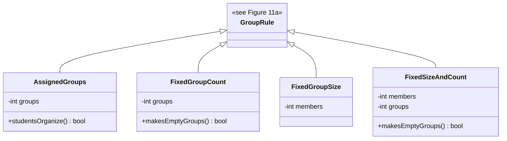
```mermaid
classDiagram
    direction TB
    class GroupRule {
        <<see Figure 11a>>
    }
    class AssignedGroups {
        -int groups
        +studentsOrganize() bool
    }
    class FixedGroupCount {
        -int groups
        +makesEmptyGroups() bool
    }
    class FixedGroupSize {
        -int members
    }
    class FixedSizeAndCount {
        -int members
        -int groups
        +makesEmptyGroups() bool
    }
    GroupRule <|-- AssignedGroups
    GroupRule <|-- FixedGroupCount
    GroupRule <|-- FixedGroupSize
    GroupRule <|-- FixedSizeAndCount
```

## Figure 12. Payments (`backend/domain/Payment.php`)

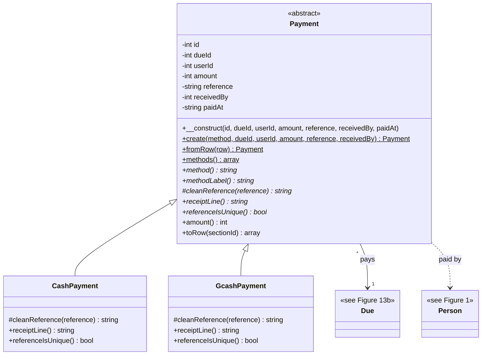
```mermaid
classDiagram
    direction TB
    class Payment {
        <<abstract>>
        -int id
        -int dueId
        -int userId
        -int amount
        -string reference
        -int receivedBy
        -string paidAt
        +__construct(id, dueId, userId, amount, reference, receivedBy, paidAt)
        +create(method, dueId, userId, amount, reference, receivedBy)$ Payment
        +fromRow(row)$ Payment
        +methods()$ array
        +method()* string
        +methodLabel()* string
        #cleanReference(reference)* string
        +receiptLine()* string
        +referenceIsUnique()* bool
        +amount() int
        +toRow(sectionId) array
    }
    class CashPayment {
        #cleanReference(reference) string
        +receiptLine() string
        +referenceIsUnique() bool
    }
    class GcashPayment {
        #cleanReference(reference) string
        +receiptLine() string
        +referenceIsUnique() bool
    }
    class Due {
        <<see Figure 13b>>
    }
    class Person {
        <<see Figure 1>>
    }
    Payment <|-- CashPayment
    Payment <|-- GcashPayment
    Payment "*" --> "1" Due : pays
    Payment ..> Person : paid by
```

Continued in Figure 13 (`Due`, `PaymentClaim`).

## Figure 13. Payment claims and dues

**13a. A payment a member says they made, waiting for the treasurer**

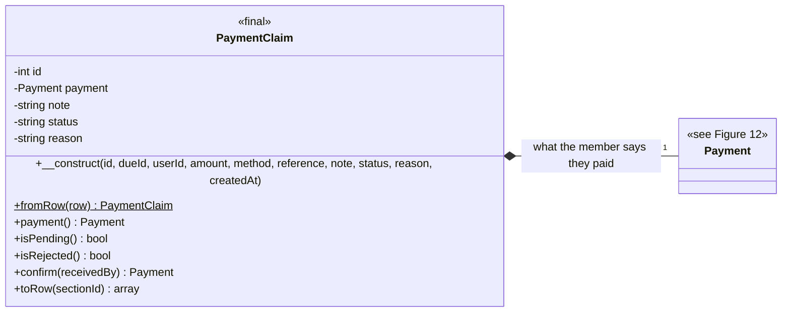
```mermaid
classDiagram
    direction LR
    class PaymentClaim {
        <<final>>
        -int id
        -Payment payment
        -string note
        -string status
        -string reason
        +__construct(id, dueId, userId, amount, method, reference, note, status, reason, createdAt)
        +fromRow(row)$ PaymentClaim
        +payment() Payment
        +isPending() bool
        +isRejected() bool
        +confirm(receivedBy) Payment
        +toRow(sectionId) array
    }
    class Payment {
        <<see Figure 12>>
    }
    PaymentClaim *-- "1" Payment : what the member says they paid
```

**13b. What a payment pays**

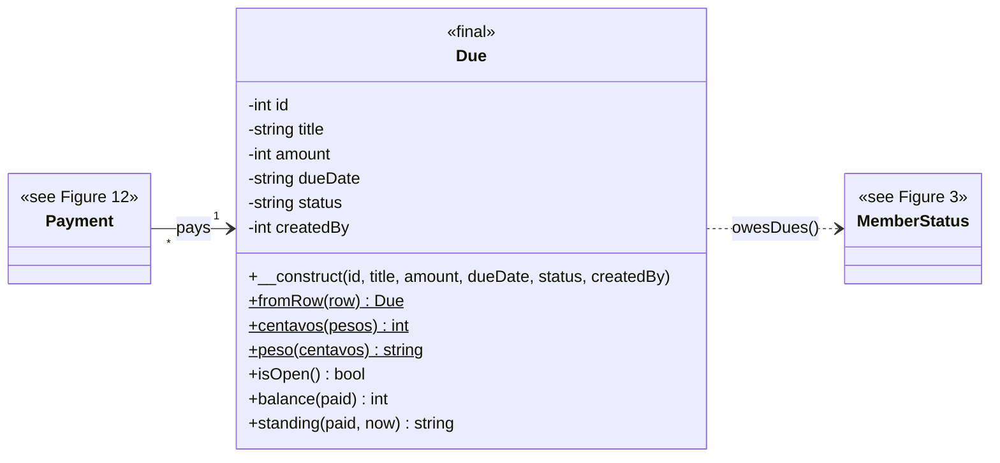
```mermaid
classDiagram
    direction LR
    class Payment {
        <<see Figure 12>>
    }
    class Due {
        <<final>>
        -int id
        -string title
        -int amount
        -string dueDate
        -string status
        -int createdBy
        +__construct(id, title, amount, dueDate, status, createdBy)
        +fromRow(row)$ Due
        +centavos(pesos)$ int
        +peso(centavos)$ string
        +isOpen() bool
        +balance(paid) int
        +standing(paid, now) string
    }
    class MemberStatus {
        <<see Figure 3>>
    }
    Payment "*" --> "1" Due : pays
    Due ..> MemberStatus : owesDues()
```

## Figure 14. Typed announcements: base class (`backend/domain/Announcement.php`)

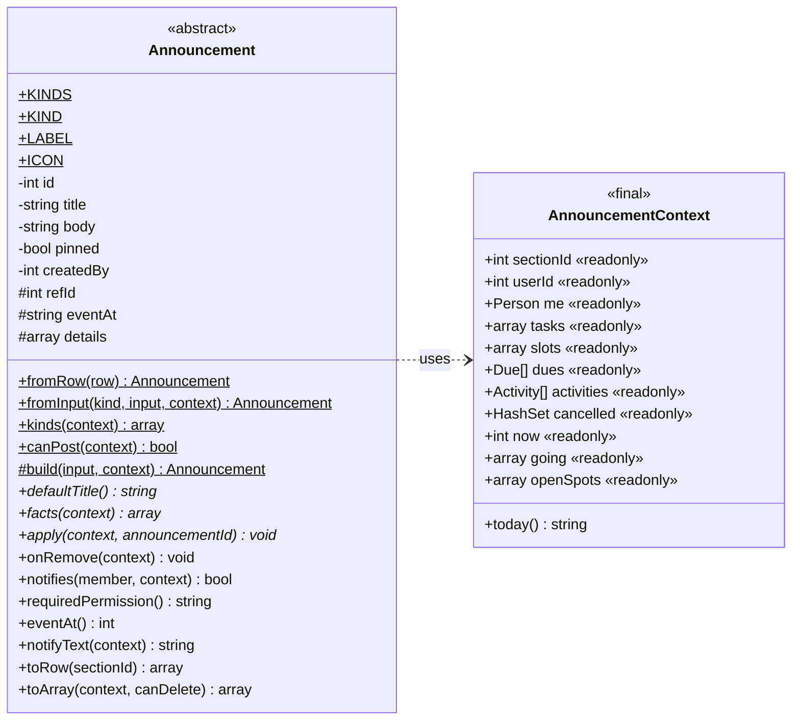
```mermaid
classDiagram
    direction LR
    class Announcement {
        <<abstract>>
        +KINDS$
        +KIND$
        +LABEL$
        +ICON$
        -int id
        -string title
        -string body
        -bool pinned
        -int createdBy
        #int refId
        #string eventAt
        #array details
        +fromRow(row)$ Announcement
        +fromInput(kind, input, context)$ Announcement
        +kinds(context)$ array
        +canPost(context)$ bool
        #build(input, context)$ Announcement
        +defaultTitle()* string
        +facts(context)* array
        +apply(context, announcementId)* void
        +onRemove(context) void
        +notifies(member, context) bool
        +requiredPermission() string
        +eventAt() int
        +notifyText(context) string
        +toRow(sectionId) array
        +toArray(context, canDelete) array
    }
    class AnnouncementContext {
        <<final>>
        +int sectionId «readonly»
        +int userId «readonly»
        +Person me «readonly»
        +array tasks «readonly»
        +array slots «readonly»
        +Due[] dues «readonly»
        +Activity[] activities «readonly»
        +HashSet cancelled «readonly»
        +int now «readonly»
        +array going «readonly»
        +array openSpots «readonly»
        +today() string
    }
    Announcement ..> AnnouncementContext : uses
```

Continued in Figure 15 (the six kinds).

## Figure 15. The six announcement kinds

Each kind does the real change it announces in `apply()`, inside the same transaction as the post.

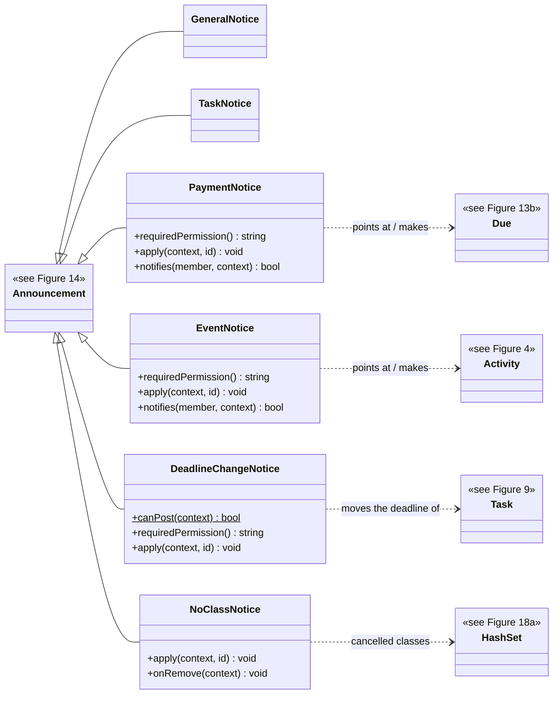
```mermaid
classDiagram
    direction LR
    class Announcement {
        <<see Figure 14>>
    }
    class GeneralNotice
    class TaskNotice
    class PaymentNotice {
        +requiredPermission() string
        +apply(context, id) void
        +notifies(member, context) bool
    }
    class EventNotice {
        +requiredPermission() string
        +apply(context, id) void
        +notifies(member, context) bool
    }
    class DeadlineChangeNotice {
        +canPost(context)$ bool
        +requiredPermission() string
        +apply(context, id) void
    }
    class NoClassNotice {
        +apply(context, id) void
        +onRemove(context) void
    }
    class Due {
        <<see Figure 13b>>
    }
    class Activity {
        <<see Figure 4>>
    }
    class Task {
        <<see Figure 9>>
    }
    class HashSet {
        <<see Figure 18a>>
    }
    Announcement <|-- GeneralNotice
    Announcement <|-- TaskNotice
    Announcement <|-- PaymentNotice
    Announcement <|-- EventNotice
    Announcement <|-- DeadlineChangeNotice
    Announcement <|-- NoClassNotice
    PaymentNotice ..> Due : points at / makes
    EventNotice ..> Activity : points at / makes
    DeadlineChangeNotice ..> Task : moves the deadline of
    NoClassNotice ..> HashSet : cancelled classes
```

## Figure 16. Undo (OOP objects kept in a DSA stack)

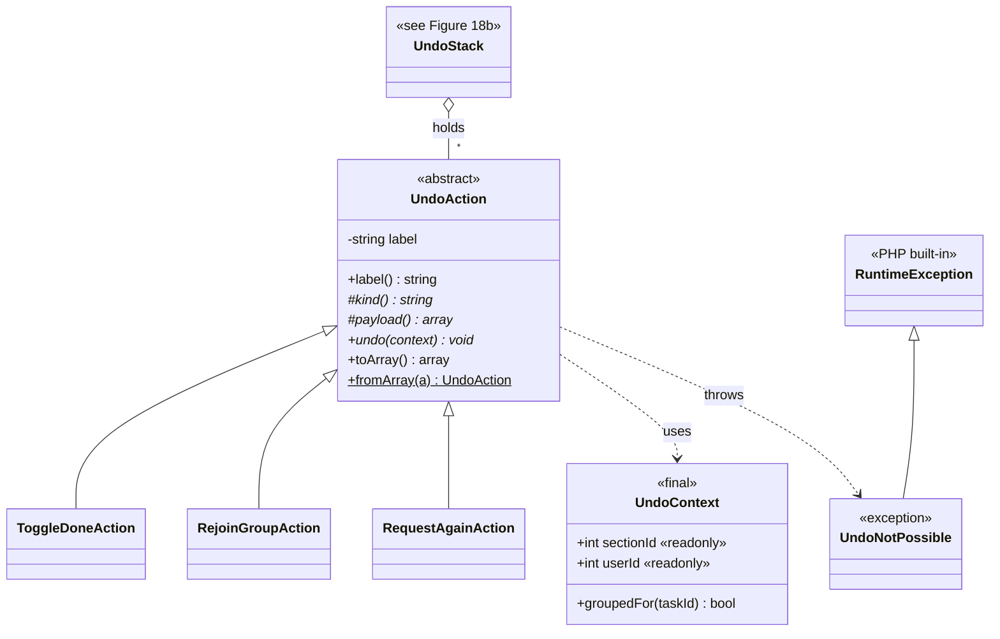
```mermaid
classDiagram
    direction TB
    class UndoStack {
        <<see Figure 18b>>
    }
    class UndoAction {
        <<abstract>>
        -string label
        +label() string
        #kind()* string
        #payload()* array
        +undo(context)* void
        +toArray() array
        +fromArray(a)$ UndoAction
    }
    class ToggleDoneAction
    class RejoinGroupAction
    class RequestAgainAction
    class UndoContext {
        <<final>>
        +int sectionId «readonly»
        +int userId «readonly»
        +groupedFor(taskId) bool
    }
    class RuntimeException {
        <<PHP built-in>>
    }
    class UndoNotPossible {
        <<exception>>
    }
    UndoStack o-- "*" UndoAction : holds
    UndoAction <|-- ToggleDoneAction
    UndoAction <|-- RejoinGroupAction
    UndoAction <|-- RequestAgainAction
    UndoAction ..> UndoContext : uses
    UndoAction ..> UndoNotPossible : throws
    RuntimeException <|-- UndoNotPossible
```

## Figure 17. Settings and e-mail

```mermaid
classDiagram
    direction LR
    class Mailer {
        <<final>>
        -string host
        -int port
        -string encryption
        -string username
        -string password
        -string from
        -string fromName
        -int timeout
        -__construct(host, port, encryption, username, password, from, fromName, timeout)
        +fromEnv()$ Mailer
        +fromSettings(settings)$ Mailer
        +describe() string
        +send(to, subject, text) void
        -message(to, subject, text) string
        -expect(socket, code) void
    }
    class Env {
        <<final>>
        -array values$
        +load(file)$ void
        +get(key, default)$ string
        +bool(key, default)$ bool
        +path(key, default)$ string
    }
    Mailer ..> Env : reads MAIL_*
```

## Figure 18. Data structures (`backend/custom_dsa.php`)

Every node class is drawn next to the structure that links its nodes.

**18a. Arrays and hash sets**

```mermaid
classDiagram
    direction TB
    class FixedArray {
        #array slots
        #int size
        #int capacity
        +add(value) bool
        +get(index) mixed
    }
    class SubjectArray
    class WeekGrid {
        -array cells
        +occupants(day, start, end) array
        +place(day, start, end, subjectId) void
    }
    class HashSet {
        -array buckets
        +add(value) bool
        +contains(value) bool
    }
    class StudentHashSet
    FixedArray <|-- SubjectArray
    HashSet <|-- StudentHashSet
```

**18b. Linked list, stack and queue**

```mermaid
classDiagram
    direction TB
    class TaskLinkedList {
        +TaskNode head
        +insertChronologically(node) void
        +removeExpired(now) array
        +deleteById(taskId) array
        +neighbors(taskId) array
    }
    class TaskNode {
        +TaskNode next
        +TaskNode prev
    }
    class UndoStack {
        -StackNode top
        -int size
        +push(value) void
        +pop() mixed
        +peek() mixed
        +removeWhere(match) mixed
    }
    class StackNode {
        +mixed value
        +StackNode below
    }
    class ApprovalQueue {
        -QueueNode front
        -QueueNode rear
        -int size
        +enqueue(value) void
        +dequeue() mixed
        +peek() mixed
    }
    class QueueNode {
        +mixed value
        +QueueNode next
    }
    TaskLinkedList o-- "*" TaskNode
    UndoStack o-- "*" StackNode
    ApprovalQueue o-- "*" QueueNode
```

## Figure 19. Trees and the dependency graph

```mermaid
classDiagram
    direction LR
    class SubjectTree {
        +TreeNode root
        +search(query) array
    }
    class ChecklistTree {
        +TreeNode root
        +rollup() array
        +subtreeIds(node) array
    }
    class TreeNode {
        +string label
        +array data
        +TreeNode[] children
        +addChild(child) TreeNode
    }
    class DependencyGraph {
        -array adjacency
        +addEdge(a, b, context, groupId) void
        +teamMembers(start, context, groupId) array
        +shortestPath(a, b) array
    }
    class ApprovalQueue {
        <<see Figure 18b>>
    }
    SubjectTree *-- "1" TreeNode : root
    ChecklistTree *-- "1" TreeNode : root
    TreeNode o-- "*" TreeNode : children
    DependencyGraph ..> ApprovalQueue : BFS uses
```

## Figure 20. Algorithms

```mermaid
classDiagram
    direction LR
    class Algorithms {
        <<final>>
        +bubbleSortByUrgency(tasks, now)$ array
        +selectionSortByLastName(students)$ array
        +selectionSortByStudentId(students)$ array
        +mergeSortBy(items, key, desc)$ array
        +binarySearchByStudentId(sorted, id)$ array
        +countDueBy(sorted, limitTs)$ int
        +linearSearch(items, target)$ int
        +linearContains(items, target)$ bool
        +linearSearchTasks(tasks, text)$ array
        +linearSearchByName(students, query)$ array
        +planGroupSizes(n, min, max, count)$ array
        +shuffle(items)$ array
    }
    class DsaUtil {
        <<final>>
        +lower(s)$ string
        +compareText(a, b)$ int
        +contains(haystack, needle)$ bool
        +digitsToInt(s)$ int
        +words(text, min)$ array
        +deadlineTs(task)$ int
    }
    Algorithms ..> DsaUtil : uses
```

## Where each pillar is used

| Pillar | Where in the code | What it does in AcadSync |
| --- | --- | --- |
| **Encapsulation** | Private fields + getters in every domain class; `Activity` (title, times, a link that must be http(s), a sign-up deadline on or before the first day), `ActivityPart`, `GroupRule`, `Due` and `Payment` check their values in the constructor and have no setters; money is whole centavos in private fields; `Env` keeps settings in a private array; `Mailer` checks its SMTP settings once (private constructor, `fromSettings()`) and only exposes `send()`; `UndoContext` uses `readonly` | An invalid activity, group rule, due or payment can't exist; nothing outside a class can change its data |
| **Inheritance** | `President`/`VicePresident`/`Secretary`/`Treasurer` → `Officer` → `Member` → `Person`; `Meeting`/`Seminar`/`Outreach`/`SectionEvent` → `RsvpActivity` → `Activity`; `Competition`/`SectionProject` → `PartsActivity` → `Activity`; `GroupTask`/`IndividualTask` → `Task`; `AssignedGroups`/`FixedGroupCount`/`FixedGroupSize`/`FixedSizeAndCount` → `GroupRule`; `CashPayment`/`GcashPayment` → `Payment`; the six notices → `Announcement`; the three `MemberStatus` and three `UndoAction` subclasses; `ExactDeadline`/`RangeDeadline` → `DatedDeadline`; `SubjectArray` → `FixedArray`, `StudentHashSet` → `HashSet`; `UndoNotPossible` → `RuntimeException` | `Officer::permissions()` adds to `parent::permissions()`; `Secretary`, `Treasurer` and `President` add to `Officer`'s; officers inherit a member's account stats |
| **Polymorphism** | `$person->can()` / `roleLabel()` / `accountStats()`; `$activity->canCheckIn()` / `expectsAttendanceFrom()` / `joinsBy()` / `usesSeats()` / `canAssignDirectly()` / `partsNeedDueDates()` (competitions and projects never touch attendance); `$status->canRsvp()` / `allows()` / `owesDues()`; `$task->acceptsGroups()` / `rule()`; `$rule->seats()` / `explain()` / `studentsOrganize()` (one class per way a prof sets up groups); `$deadline->timestamp()` / `attentionAt()` (an open date range counts as today); `$action->undo()`; `$payment->receiptLine()` / `referenceIsUnique()`; `$announcement->apply()` / `facts()` / `onRemove()` | The endpoints never test `role === 'admin'`, the activity kind, `work_mode`, `deadline_type`, the payment method or the announcement kind: each object answers for itself |
| **Abstraction** | `interface Deadline`; `abstract class Person`, `Officer`, `MemberStatus`, `Activity`, `RsvpActivity`, `PartsActivity`, `Task`, `GroupRule`, `DatedDeadline`, `UndoAction`, `Payment`, `Announcement` | Callers use what an object can do, not how it does it |

## Relationships

| Relationship | Kind | Figure | Meaning |
| --- | --- | --- | --- |
| `Person` ◆— `MemberStatus` | composition | 1, 3 | every person has exactly one status; it can hold back permissions (Alumni) |
| `Task` ◆— `Deadline`, `GroupTask` ◆— `GroupRule` | composition | 9, 10, 11 | a task owns its deadline and its group rule |
| `ActivityRoster` ◆— `HashSet`, `ApprovalQueue` | composition | 8 | going / checked-in sets and the waitlist queue of one activity |
| `ActivityRoster` → `Activity` | dependency | 8 | a freed seat goes to the first person waiting whom the activity is for (`isFor()`), while it `hasRoom()` |
| `PartsActivity` ◆— `ActivityPart` | composition | 7 | a competition or project owns its parts (at least one) |
| `PartRoster` ◆— `ApprovalQueue`, `HashSet` | composition | 7 | a part's volunteers in arrival order and who is picked |
| `ActivityPart` / `PartRoster` → `Activity` | dependency | 7 | the part asks its activity for the due-date rule; the roster asks whether sign-ups are open and whether officers may assign directly |
| `MemberRecord` ◇— `Person`, uses `Activity` | aggregation / dependency | 8 | a record is built from a person and asks each activity who was expected |
| `UndoStack` ◇— `UndoAction` | aggregation | 16 | the DSA stack holds OOP objects that know how to reverse themselves |
| `GroupRule` → `StudyGroup` | association | 11 | the rule evaluates a task's groups (seats left, +1 extra seats, who may join) |
| `Payment` → `Due` | association | 12, 13 | many payments (part-payments too) settle one due |
| `ApprovalQueue` ◆— `QueueNode`, `UndoStack` ◆— `StackNode`, `TreeNode` ◇— `TreeNode` | composition / aggregation | 18, 19 | each structure links its own node objects |
| `Algorithms` → `DsaUtil` | dependency | 20 | the sorts and searches use the hand-written text helpers |
